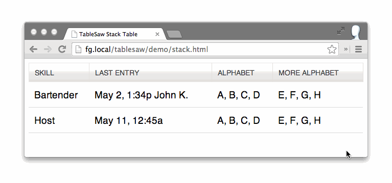
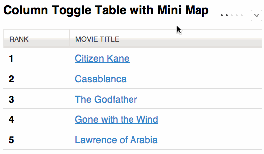
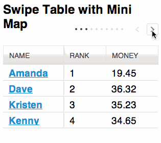
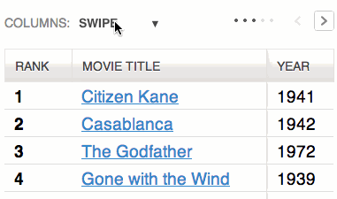
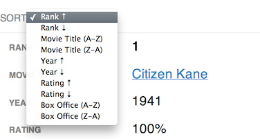

# Tablesaw

[](https://badge.fury.io/js/tablesaw)
[](https://travis-ci.org/filamentgroup/tablesaw)
[](https://david-dm.org/filamentgroup/tablesaw)

[ ](http://www.filamentgroup.com/)

A set of plugins for responsive tables.

* [Getting Started](#getting-started)
* [Stack Mode](#stack-mode)
* [Column Toggle Mode](#column-toggle-mode)
* [Swipe Mode](#swipe-mode)
* [Mini-Map](#mini-map)
* [Mode Switcher](#mode-switcher)
* [Sortable](#sortable)
* [Kitchen Sink Example](http://filamentgroup.github.io/tablesaw/demo/kitchensink.html)
* [Check All](#check-all)
* [Internationalization i18n](#internationalization-i18n)
* [Limitations](#limitations)
* [Run Tests](http://filamentgroup.github.io/tablesaw/test-qunit/tablesaw.html)
* [Browser Support](#browser-support)
* [Bundler Compatibility](#bundler-compatibility)

## Roadmap and Enhancement Queue

This repository is now using [lodash style issue management](https://twitter.com/samselikoff/status/991395669016436736) for enhancements. This means enhancement issues will be closed instead of leaving them open.

* Look through [the enhancement backlog](https://github.com/filamentgroup/tablesaw/issues?q=label%3Aneeds-votes+is%3Aclosed+sort%3Areactions-%2B1-desc) and vote for your favorite features by adding a 👍 to the top comment.

## Stack Mode

* [Stack Demo](http://filamentgroup.github.io/tablesaw/demo/stack.html) and [Stack-Only Demo](http://filamentgroup.github.io/tablesaw/demo/stackonly.html)

The Stack Table stacks the table headers to a two column layout with headers on the left when the viewport width is less than `40em` (`640px`).



```html
<table class="tablesaw tablesaw-stack" data-tablesaw-mode="stack">
```

If you only want to use the Stack Table and don’t want all the extra features below (save yourself some bytes), Tablesaw provides a Stack-Only version.

| Option | Description |
| --- | --- |
| Opt out of inline labels | To opt-out of inline label creation (the table header cell text that shows at small breakpoints) on a per-table basis, use `<table data-tablesaw-no-labels>`; on a per-row basis, use `<tr data-tablesaw-no-labels>`; on a per-cell basis, use `<td data-tablesaw-no-labels>` (added in v3.1.0) |
| Hide headers for empty body cells | When the table cell is empty, use `<table data-tablesaw-hide-empty>` to hide the header when stacked. |

## Column Toggle Mode

* [Column Toggle Demo](http://filamentgroup.github.io/tablesaw/demo/toggle.html)

The Column Toggle Table allows the user to select which columns they want to be visible.



```html
<table data-tablesaw-mode="columntoggle">
```

| Option | Description |
| --- | --- |
| Add a Mini-Map | The little dots that appear next to the column toggle popup. Use the `data-tablesaw-minimap` attribute: `<table data-tablesaw-mode="columntoggle" data-tablesaw-minimap>` |

The user always has the option to select all columns. If the table gets too wide for the viewport, it can overflow and cause a page-level scrollbar. To combat this issue, we recommend wrapping your table in a `<div class="tablesaw-overflow">` element to restrict scrolling to the table-only. The [toggle demo](http://filamentgroup.github.io/tablesaw/demo/toggle.html) has one such example.

<details>
<summary><em>Advanced Option</em>: Prioritize Columns</summary>

Table headers must have a `data-tablesaw-priority` attribute to be eligible to toggle. `data-tablesaw-priority` is a numeric value from 1 to 6, which determine default breakpoints at which a column will show. The breakpoint defaults are:

```html
<th data-tablesaw-priority="persist"><!-- Not eligible for toggle, always shows --></th>
<th data-tablesaw-priority="0"><!-- Hidden at all breakpoints by default, must be toggled back on manually --></th>
<th data-tablesaw-priority="1"><!-- Shows at (min-width: 20em) (320px) --></th>
<th data-tablesaw-priority="2"><!-- Shows at (min-width: 30em) (480px) --></th>
<th data-tablesaw-priority="3"><!-- Shows at (min-width: 40em) (640px) --></th>
<th data-tablesaw-priority="4"><!-- Shows at (min-width: 50em) (800px) --></th>
<th data-tablesaw-priority="5"><!-- Shows at (min-width: 60em) (960px) --></th>
<th data-tablesaw-priority="6"><!-- Shows at (min-width: 70em) (1120px) --></th>
```

Keep in mind that the priorities are not exclusive—multiple columns can reuse the same priority value.

</details>

## Swipe Mode

* [Swipe Demo](http://filamentgroup.github.io/tablesaw/demo/swipe.html)

Allows the user to use the swipe gesture (or use the left and right buttons) to navigate the columns.



```html
<table data-tablesaw-mode="swipe">
```


| Options | Description |
| --- | --- |
| Persist a Column | Columns also respect the `data-tablesaw-priority="persist"` attribute: `<th data-tablesaw-priority="persist"><!-- Always shows --></th>` |
| Add a Mini-Map | The little dots that appear next to the column navigation buttons. Use the `data-tablesaw-minimap` attribute: `<table data-tablesaw-mode="swipe" data-tablesaw-minimap>` |
| All columns visible class | Tablesaw also exposes a `tablesaw-all-cols-visible` class that is toggled on when all of the table columns are visible (and off when not). You can use this in CSS to hide the minimap or navigation buttons if needed. |
| Disable swipe touch events | Use the `<table data-tablesaw-no-touch>` attribute to opt-out of swiping left or right to navigate columns. Users will need to use the provided buttons instead. |

<details>
<summary><em>Advanced Option</em>: Configure Swipe Thresholds</summary>

Add a `TablesawConfig` object to your page in a `<script>` element. It doesn’t matter if it’s declared before or after the Tablesaw JavaScript.

```js
<script>
TablesawConfig = {
  swipeHorizontalThreshold: 15,
  swipeVerticalThreshold: 20
};
</script>
```

* [Configure Swipe Threshold Demo](http://filamentgroup.github.io/tablesaw/demo/swipe-config.html)

</details>

## Mini Map

Use `data-tablesaw-minimap` to add a series of small dots to show which columns are currently visible and which are hidden. Only available on `swipe` and `columntoggle` tables. Examples available above.

## Mode Switcher

* [Mode Switcher Demo](http://filamentgroup.github.io/tablesaw/demo/modeswitch.html)



```html
<table data-tablesaw-mode-switch>

<!-- With a different default mode -->
<table data-tablesaw-mode-switch data-tablesaw-mode="swipe">

<!-- Exclude a mode from the switcher -->
<table data-tablesaw-mode-switch data-tablesaw-mode-exclude="columntoggle">
```

## Sortable

* [Sortable Demo](http://filamentgroup.github.io/tablesaw/demo/sort.html)

The “sortable” option allows the user to sort the table data by clicking on the table headers. Since all the columns may not be visible on smaller breakpoints (or not there at all if using the “stack” table mode), relying solely on the column headers to choose the table sort isn’t practical. To address this, there is an optional `data-tablesaw-sortable-switch` attribute on the table that adds a select menu auto-populated with the names of each column in the table with options for choosing ascending or descending sort direction. Data options on table headers can be used to control which columns are sortable (`data-tablesaw-sortable-col`) and the default sort order (`data-tablesaw-sortable-default-col`).

```html
<table data-tablesaw-sortable>
    <thead>
        <tr>
            <!-- Default column -->
            <th data-tablesaw-sortable-col data-tablesaw-sortable-default-col>Rank</th>
            <th data-tablesaw-sortable-col>Movie Title</th>
            <th data-tablesaw-sortable-col data-tablesaw-sortable-numeric>Year</th>
            <th data-tablesaw-sortable-col data-tablesaw-sortable-numeric><abbr title="Rotten Tomato Rating">Rating</abbr></th>
            <!-- Unsortable column -->
            <th>Reviews</th>
        </tr>
    </thead>
    ...
```

Use `data-tablesaw-sortable-switch` to add a select form element to manually choose the sort order.

```html
<table data-tablesaw-sortable data-tablesaw-sortable-switch>
```



<details>
<summary><em>Advanced Option</em>: Custom Sort Functions</summary>

Tablesaw provides two methods of sorting built-in: string and numeric. To use numeric sort, use the `data-tablesaw-sortable-numeric` class as shown in the above sorting markup example. Otherwise, tablesaw uses a case insensitive string sort.

All other types of sorting must use a Custom Sort function on the individual columns ([working example](http://filamentgroup.github.io/tablesaw/demo/sort-custom.html)). In the contrived example below, we want to sort full dates (e.g. `12/02/2014`) just on the year.

```
// Add a data function to the table header cell
$( "th#custom-sort" ).data( "tablesaw-sort", function( ascending ) {
    // return a function
    return function( a, b ) {
        // Ignore rows with data-tablesaw-ignorerow (leave them where they were)
        if( a.ignored || b.ignored ) {
            return 0;
        }

        // use a.cell and b.cell for cell values
        var dateA = a.cell.split( "/" ),
            dateB = b.cell.split( "/" ),
            yearA = parseInt( dateA[ 2 ], 10 ),
            yearB = parseInt( dateB[ 2 ], 10 );

        if( ascending ) {
            return yearA >= yearB ? 1 : -1;
        } else { // descending
            return yearA < yearB ? 1 : -1;
        }
    };
});
```

</details>

## Kitchen ~~Table~~ Sink

* [Kitchen Sink Demo](http://filamentgroup.github.io/tablesaw/demo/kitchensink.html)

All of the above options combined into a single table.

## Check All

_Added in 3.0.1._  Add the `data-tablesaw-checkall` to a checkbox in a `thead` cell to enable that checkbox to toggle the other checkboxes in the same column.

* [Check All Demo](http://filamentgroup.github.io/tablesaw/demo/checkall.html)

## Internationalization i18n

_Added in 3.0.2._ Use the `TablesawConfig` global on your page to override internationalization strings. It doesn’t matter if it’s declared before or after the Tablesaw JavaScript library.

```js
<script>
TablesawConfig = {
  i18n: {
    modeStack: 'Stack',
    modeSwipe: 'Swipe',
    modeToggle: 'Toggle',
    modeSwitchColumnsAbbreviated: 'Cols',
    modeSwitchColumns: 'Columns',
    columnToggleButton: 'Columns',
    columnToggleError: 'No eligible columns.',
    sort: 'Sort',
    swipePreviousColumn: 'Previous column',
    swipeNextColumn: 'Next column'
  }
};
</script>
```

## Getting Started

Available through npm:

```
npm install tablesaw
```

### The Full Tablesaw

<details open>
<summary>Tablesaw (no dependencies)</summary>

```html
<link rel="stylesheet" href="tablesaw.css">
<script src="tablesaw.js"></script>
<script src="tablesaw-init.js"></script>
```

</details>

<details open>
<summary>or Tablesaw (jQuery Plugin)</summary>

```html
<link rel="stylesheet" href="tablesaw.css">
<!-- load your own jQuery -->
<script src="jquery.js"></script>
<script src="tablesaw.jquery.js"></script>
<script src="tablesaw-init.js"></script>
```

</details>

Don’t forget to add your table markup! For a stack table, this is how it’d look: 

```html
<table class="tablesaw tablesaw-stack" data-tablesaw-mode="stack">
```

The demos above include full markup examples for all of the Tablesaw types.

#### Manual initialization of Tablesaw Components

If you want to initialize your Tablesaw tables manually, don’t include `<script src="tablesaw-init.js">` in your markup. Instead, you can use `Tablesaw.init()`. This will scan the tree for any Tablesaw tables and initialize them for you.

*Tables must be visible for proper initialization.*

```js
Tablesaw.init();
Tablesaw.init( myElement ); // OR pass an element to only init within a context
```

#### Dynamically Loading Tablesaw

For user interfaces that are dynamically built, Tablesaw can be loaded on an as-needed basis.  
Here's how you might do this with jQuery:

```js
$('head').append('<script src="tablesaw.js"></script>');
```

Following that, tables may be initialized manually as they are created.

### Using Stack-Only Tablesaw

* [Stack-Only Demo](http://filamentgroup.github.io/tablesaw/demo/stackonly.html)

As shown above, we provide a Stack-mode-only package of Tablesaw. It’s a barebones version that doesn’t include any of the other features above.

<details open>
<summary>Stack-only Tablesaw (no dependencies)</summary>

```html
<link rel="stylesheet" href="tablesaw.css">
<script src="stackonly/tablesaw.stackonly.js"></script>
<script src="tablesaw-init.js"></script>
```

</details>

<details open>
<summary>or just Stack-only Tablesaw (jQuery Plugin)</summary>

```html
<link rel="stylesheet" href="tablesaw.css">
<!-- load your own jQuery -->
<script src="jquery.js"></script>
<script src="stackonly/tablesaw.stackonly.jquery.js"></script>
<script src="tablesaw-init.js"></script>
```

</details>

And then:

```html
<table class="tablesaw tablesaw-stack" data-tablesaw-mode="stack">
```

### Using Stack-Only Tablesaw SCSS Mixin

To easily customize the breakpoint at which the stack table switches, use the SCSS mixin.  First, include the `tablesaw.stackonly.scss` file instead of `tablesaw.stackonly.css` in your SASS. Then, use a parent selector on your table.

```html
<div class="my-parent-selector">
    <table class="tablesaw" data-tablesaw-mode="stack">
```

Include the mixin like so:

```scss
.my-parent-selector {
  @include tablesaw-stack( 50em );
}
```

The argument to `tablesaw-stack` is the breakpoint at which the table will switch from columns to stacked.

### Default Styles

_Starting with Tablesaw 3.0, the “Bare”, or stripped down style version of Tablesaw has been made the default._

Some of the more intrusive default styles have instead moved to opt-in classes you can add to the `<table>` element:

* `tablesaw-row-border`: Adds a bottom border to each table row.
* `tablesaw-row-zebra`: Adds a light background color to every other table row.
* `tablesaw-swipe-shadow`: Adds the light shadow to the right of persistant columns to make them stand out a little more.

## Limitations

* Simple `colspan` and `rowspan` are supported, in part thanks to a [lovely PR](https://github.com/filamentgroup/tablesaw/pull/225) from @jgibson.

| | Stack | Column Toggle | Swipe | Sortable |
| --- | --- | --- | --- | --- |
| `rowspan` | _Not yet supported_ ([#247](https://github.com/filamentgroup/tablesaw/issues/247)) | Supported | Supported | _Not yet supported_ ([#268](https://github.com/filamentgroup/tablesaw/issues/268)) |
| `colspan` | Supported | Supported | Supported | Supported |

## [Tests](http://filamentgroup.github.io/tablesaw/test-qunit/tablesaw.html)

## Browser Support

All major browsers (evergreens are not listed, but supported). Notably this project cuts the mustard for A-grade support with:

* Internet Explorer 9+
* Android Browser 2.3+
* Blackberry OS 6+

Other legacy browsers and Opera Mini receive unenhanced table markup.

## Bundler Compatibility

* Added in `v3.0.6`: [tested to work in Webpack](./demo/webpack/).

## Building the Project Locally

Run `npm install` to install dependencies and then `grunt` to build the project files into the `dist` folder.

## Release Names

* [3.1.0: Acacia](https://github.com/filamentgroup/tablesaw/releases/tag/v3.1.0)
* [3.0.6: Wonderboom](https://github.com/filamentgroup/tablesaw/releases/tag/v3.0.6)
* [3.0.3: Cucumbertree](https://github.com/filamentgroup/tablesaw/releases/tag/v3.0.3)
* [3.0.2: Bald Cypress](https://github.com/filamentgroup/tablesaw/releases/tag/v3.0.2)
* [3.0.1: Cypress](https://github.com/filamentgroup/tablesaw/releases/tag/v3.0.1)
* [3.0.0: Rosewood](https://github.com/filamentgroup/tablesaw/releases/tag/v3.0.0)
* [2.0.1: Mountain Hemlock](https://github.com/filamentgroup/tablesaw/releases/tag/v2.0.1)
* [2.0.0: Hemlock](https://github.com/filamentgroup/tablesaw/releases/tag/v2.0.0)
* [1.0.5: Hickory](https://github.com/filamentgroup/tablesaw/releases/tag/v1.0.5)
* [1.0.4: Ironwood](https://github.com/filamentgroup/tablesaw/releases/tag/v1.0.4)
* [1.0.3: Red Mahogany](https://github.com/filamentgroup/tablesaw/releases/tag/v1.0.3)

_Previous versions didn’t have names._
